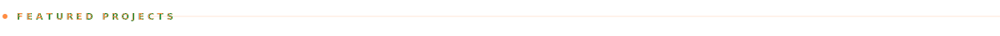
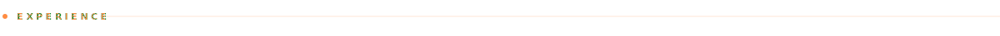

&nbsp;

<table>
<tr>
<td width="50%" valign="top">

### Custom Game Engine + Multiplayer 3D FPS

▸ &nbsp; Vulkan · DX12 · Metal cross-platform

C++ engine on SDL3 / SDL_GPU dispatching natively to Vulkan, DirectX 12, and Metal. Authoritative netcode with client prediction + lag compensation. PBR, cascaded shadow maps, GTAO, SSR, volumetric lighting, SMAA T2x.

</td>
<td width="50%" valign="top">

### GPU Kernel Optimization · CUDA / OpenCL BLAS

▸ &nbsp; 85 % of cuBLAS SGEMM on RTX 4090

Dense GEMM with shared-memory tiling, warp-shuffle reductions, and register micro-tiling. Nsight + roofline analysis on RTX 3090 / 4090.

</td>
</tr>
<tr>
<td width="50%" valign="top">

### Multi-Region GPU Inference Cluster

▸ &nbsp; Self-hosted Kubernetes, 6 GPUs, multi-site

Bare-metal Kubernetes across multiple sites for vLLM serving + LoRA finetuning experiments. Prometheus / Grafana telemetry.

</td>
<td width="50%" valign="top">

### Post-Quantum Encrypted Messaging

▸ &nbsp; Kyber-1024 + X3DH + Double Ratchet

E2E encrypted chat with identifier-free relays + custom anti-DPI TLS obfuscation. Go backend, TypeScript / React / Electron client.

</td>
</tr>
</table>

&nbsp;

▸ &nbsp; **Upgrading fintech infrastructure at Polity Network** — took a single-EC2 monolith to a real AWS EKS cluster with OpenTofu + ArgoCD. Ephemeral per-PR review environments cut the release cycle ~40 %.

▸ &nbsp; **Bringing Google Pixel SoCs up over PXE for a 20,000-phone datacenter at UCSD × Google.** Living in the bootloader / kernel layer — UART debug, porting Android kernel modules into mainline Linux.

&nbsp;

<table>
<tr>
<td valign="middle" width="14%"><strong>LANGUAGES</strong></td>
<td valign="middle">

</td>
</tr>
<tr>
<td valign="middle" width="14%"><strong>GPU&nbsp;/&nbsp;HPC</strong></td>
<td valign="middle">

</td>
</tr>
<tr>
<td valign="middle" width="14%"><strong>AI&nbsp;/&nbsp;ML</strong></td>
<td valign="middle">

</td>
</tr>
<tr>
<td valign="middle" width="14%"><strong>INFRA</strong></td>
<td valign="middle">

</td>
</tr>
<tr>
<td valign="middle" width="14%"><strong>SECURITY</strong></td>
<td valign="middle">

</td>
</tr>
</table>

&nbsp;

> Currently open to GPU systems, ML infrastructure, and high-performance engineering roles for new-grad 2026.

▸ &nbsp; **Email** &nbsp; · &nbsp; [`dkatulevskiy@gmail.com`](mailto:dkatulevskiy@gmail.com)

▸ &nbsp; **GitHub** &nbsp; · &nbsp; [`github.com/Katulevskiy`](https://github.com/Katulevskiy)

▸ &nbsp; **Resume** &nbsp; · &nbsp; [`Daniil Katulevskiy CV.pdf →`](./Daniil%20Katulevskiy%20CV.pdf)

✦

